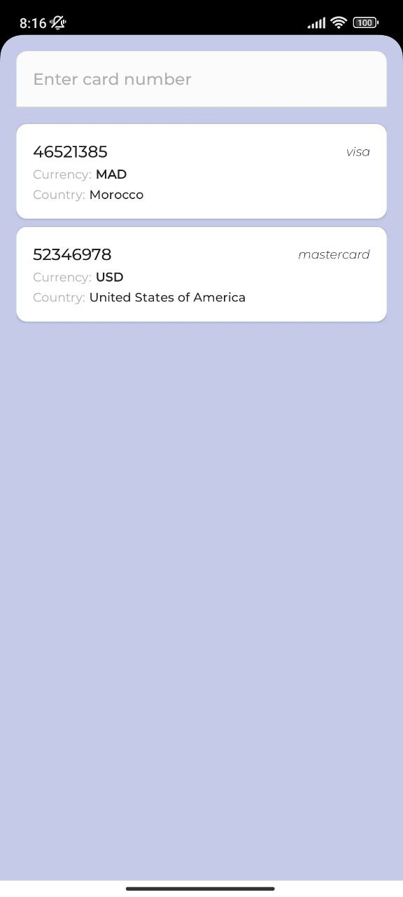

# BinListProject

1. Пользователь вводит BIN банковской карты и видит всю доступную информацию о нём
2. История предыдущих запросов выводится списком
3. История предыдущих запросов не теряется при перезапуске приложения
4. Нажатие на URL банка, телефон банка, координаты страны отправляет пользователя в
приложение, которое может обработать эти данные (браузер, звонилка, карты).
_________________________________________________________________________________________________________________________________________________________  

Стэк:
------------------------
* Kotlin
* MVVM, Clean Architecture
* Hilt
* Retrofit2
* Room
* Cotoutines + Flow
_________________________________________________________________________________________________________________________________________________________

Demo:
-----------------

